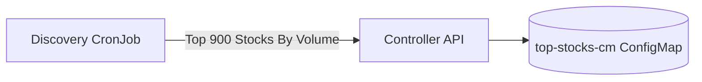
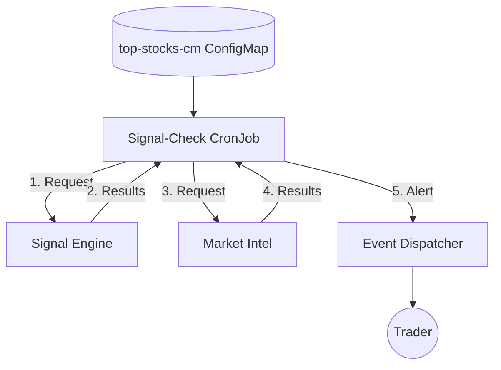

# StockFlow

[](https://github.com/AvinashSubhash/stockflow/actions/workflows/build.yml)
[](https://github.com/AvinashSubhash/stockflow/actions/workflows/deploy-stockflow.yml)

**StockFlow** is a modern, microservice-based automated stock analysis platform. It leverages advanced technical indicators and AI-driven sentiment analysis to identify high-probability trading opportunities in the NSE market.

> [!NOTE]
> The entire project is built and deployed on **ARM-based architecture** (Ampere A1).

---

## Vision
StockFlow serves as an automated "L1 Analyst" for my personal trading workflow. It handles the heavy lifting of preliminary market screening—filtering hundreds of stocks based on technical indicators and volume anomalies, and passes only the highest-conviction setups to an AI for final validation. The goal is to eliminate noise, save time on manual chart reading, and deliver curated, actionable alerts straight to my inbox.

## Architecture
The system consists of three primary engines working in concert:

### 1. Market Scanning & Discovery


### 2. Daily Analysis Orchestration


### 3. Health Check & Resilience


## System Design & Operations
- **[Architecture & Signal Logic](docs/architecture.md)**: Details on the 3-layer BharatQuant v4 strategy, the automated daily discovery pipeline, and the resilience health checks.
- **[Operations & Deployment](docs/operations.md)**: CI/CD deployment guide, K3s infrastructure map, and internal API references.

## Prerequisites
- **Kubernetes Cluster**: A running K8s or K3s cluster is required.
- **Ingress Controller**: Traefik must be installed and configured (see `infra/traefik-config.yaml` for a sample K3s configuration).
- **External Dependencies**: You need an OpenAI API key and an SMTP account for alerts.

## Quick Start
1. **Clone the Repository**:
   ```bash
   git clone https://github.com/tekpeek/stockflow.git
   cd stockflow
   ```
2. **Deploy with Helm**:
   Set your API keys and run the deployment script. The script requires five arguments: `OPENAI_API_KEY`, `SMTP_PASSWORD`, `SF_API_KEY`, `NAMESPACE`, and `IMAGE_VERSION`.

   ```bash
   # Export required secrets
   export OPENAI_API_KEY="your_openai_key"
   export SMTP_PASSWORD="your_smtp_password"
   export SF_API_KEY="your_internal_api_key" # A secure token string used to authenticate internal API requests

   # Deploy (Defaults: namespace="dev", version="dev")
   ./helm/deploy_helm.sh "$OPENAI_API_KEY" "$SMTP_PASSWORD" "$SF_API_KEY" "dev" "dev"
   ```

---
