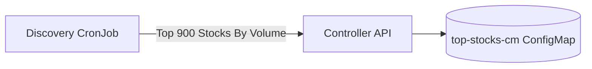
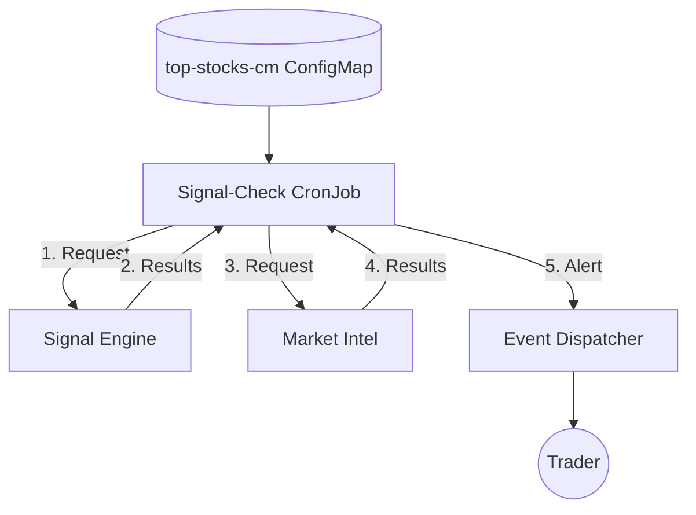

# StockFlow

[](https://github.com/AvinashSubhash/stockflow/actions/workflows/build.yml)
[](https://github.com/AvinashSubhash/stockflow/actions/workflows/deploy-stockflow.yml)

**StockFlow** is a modern, microservice-based automated stock analysis platform. It leverages advanced technical indicators and AI-driven sentiment analysis to identify high-probability trading opportunities in the NSE market.

---

## Vision
Built to streamline the preliminary screening of the "stock universe," StockFlow automates the transition from raw market data to curated, AI-validated trading alerts. It operates as a resilient "Resilience Mesh," integrating with external tools for health checks and notifications.

## Architecture
The system consists of three primary engines working in concert:

### 1. Market Scanning & Discovery


### 2. Daily Analysis Orchestration


### 3. Health Check & Resilience

For a deep dive into the system design, see the **[Architecture PRD](docs/prds/architecture-prd.md)**.

## Microservices & Logic
- **[Signal Engine](docs/prds/signal-engine-prd.md)**: Logic behind the "BharatQuant v4" 3-layer hierarchy.
- **[Discovery & Automation](docs/prds/discovery-prd.md)**: How we scan 500+ NSE stocks and validate them with AI.
- **[API Specification](docs/api/api-spec.md)**: Technical reference for all service endpoints.

## Technical Specifications
- **[System Architecture Spec](docs/specs/architecture-techspec.md)**: Technical design and ecosystem integration.
- **[Signal Engine Spec](docs/specs/signal-engine-techspec.md)**: Implementation details of V4 scoring.

## Deployment & Operations
StockFlow is containerized with Docker and orchestrated via Kubernetes (K3s). 
- **[Operations Guide](docs/ops/ops-guide.md)**: Deployment, Health Monitoring, and CI/CD pipelines.

## Quick Start
1. **Clone & Setup**:
   ```bash
   git clone https://github.com/AvinashSubhash/stockflow.git
   ```
2. **Environment Variables**:
   Set `OPENAI_API_KEY`, `SF_API_KEY`, and `SMTP_PASSWORD` in your K8s secrets.
3. **Deploy**:
   ```bash
   ./infra/install-helm.sh
   ./helm/deploy_helm.sh default
   ```

---
