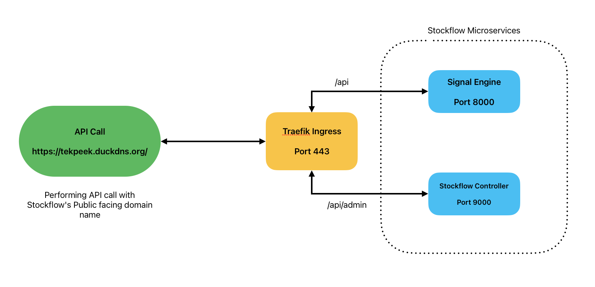
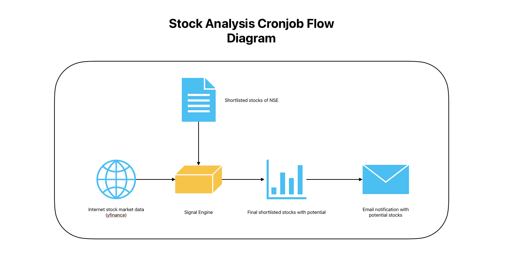
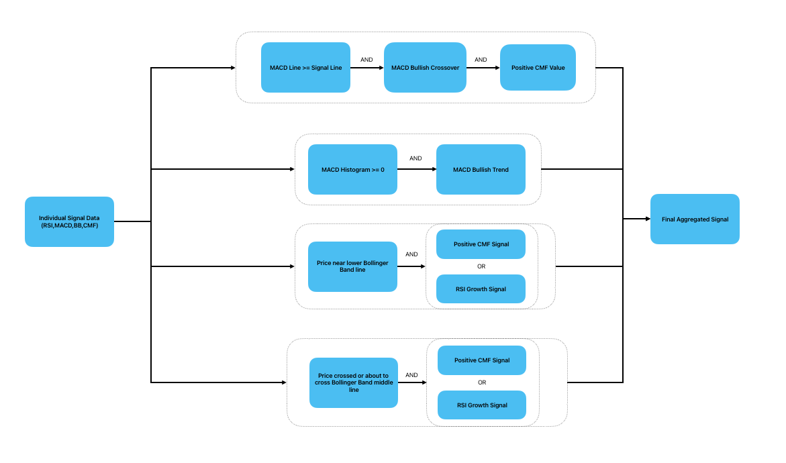
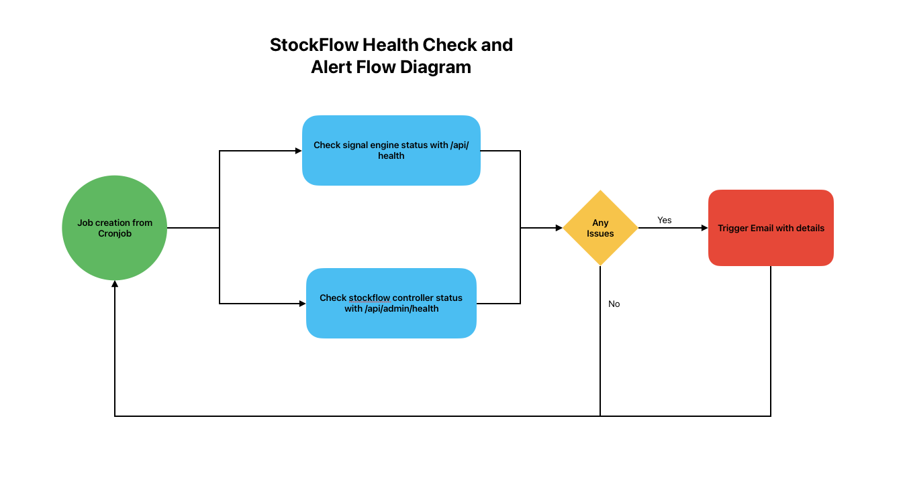
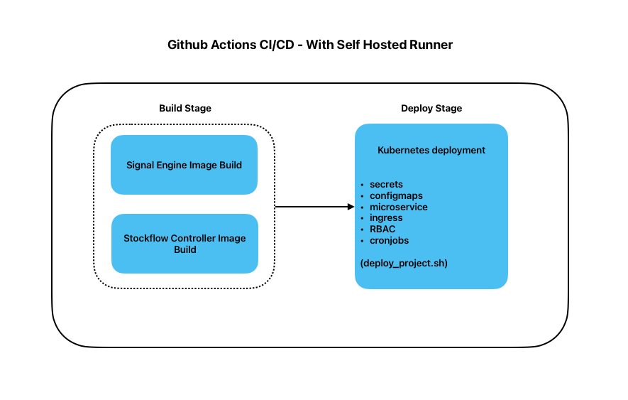

# StockFlow - Real-Time Stock Signal Analysis Microservice

StockFlow is an automated stock analysis platform developed to enhance the efficiency of identifying potential trading opportunities. Designed to replicate and automate the analytical methods and indicators I typically employ, StockFlow systematically evaluates a broad range of stocks and generates a curated shortlist of candidates warranting further review.

## Why was it built ?
This tool is intended to serve as an initial screening layer for me, providing structured assistance in narrowing down the universe of stocks to those with promising characteristics. It is not a definitive prediction system to be relied upon blindly but rather a time-saving aid that supports more focused and informed decision-making. By automating the preliminary stages of analysis, StockFlow significantly reduces the effort and time required by me to identify high-potential stocks for further evaluation.

## Who is it for ?
Anyone who wants to trim down potential stocks to a limited count so that they can invest less time in initial screening and focus on more deeper analysis.

## Link to StockFlow Web App

🌐 **Live Application**: [StockFlow Web App](https://avinashsubhash.github.io/stockflow)

📊 **API Documentation**: [API Documentation](docs/API_README.md)

## Live Workflow Status

Image Build Workflow


Deploy Workflow


## Getting Started

### Prerequisites
- **Kubernetes Cluster** (K3s recommended)
- **Docker**
- **Python 3.9+**
- **kubectl** configured for your cluster

### Installation

1. **Clone the Repository**
   ```bash
   git clone https://github.com/AvinashSubhash/stockflow.git
   cd stockflow
   ```

2. **Configure Environment Variables**
   You need to set up the following environment variables.
   
   **Required Environment Variables:**
   - `OPENAI_API_KEY`: For Market Intel Engine
   - `SF_API_KEY`: Set a Unique Key for Admin API Authentication
   - `SMTP_PASSWORD`: For email notifications

3. **Deploy to Kubernetes**
   Use the deployment script to deploy to the `default` namespace:
   ```bash
   chmod +x deploy_project.sh
   ./deploy_project.sh default
   ```
   *To deploy to a custom namespace (e.g., dev):*
   ```bash
   ./deploy_project.sh dev
   ```

### Configuration
The system uses Kubernetes ConfigMaps and Secrets for configuration.

**Strategy Configuration (`strategy-config` Secret):**
- `interval`: Candle interval (default: "1d")
- `period`: Lookback period (default: 14)
- `window`: Bollinger Band window (default: 20)
- `num_std`: Standard Deviations (default: 2)

**Maintenance Mode:**
Controlled via the `maintenance-config` ConfigMap. Use the Admin API to toggle.

## Features

### **Signal Engine**
- **Multi-Indicator Analysis**: Identifying potential entry points by combining signals from RSI, MACD, Bollinger Bands, CMF (Chaikin Money Flow)
- **Real-time Data**: Live stock data from Yahoo Finance
- **Dynamic Stock Universe**: Automatically updates and scans the top 500 NSE stocks by trading volume
- **Confidence Scoring**: Signal strength assessment (Weak/Strong)
- **Externalized Strategy**: Configurable strategy parameters (Interval, Period, Window, StdDev) via Kubernetes Secrets
- **Health check API**: Health check API to detect status of microservice

### **StockFlow Controller**
- **Manual Job Trigger through API**: Administrative API endpoint for triggering manual job from conjob using API call
- **Maintenance Mode**: Administrative control to enable/disable system maintenance mode, pausing API responses during updates
- **Health check API**: Health check API to detect status of microservice

### **Market Intel Engine**
- **AI-Powered Analysis**: Performs sentiment analysis on stock tickers using OpenAI (GPT-5)
- **Signal Validation**: Validates technical buy signals with AI-driven sentiment scores; only stocks with high ratings are alerted

### **Technical Indicators**
- **RSI (Relative Strength Index)**: Momentum oscillator with smoothing
- **MACD (Moving Average Convergence Divergence)**: Trend and momentum analysis
- **Bollinger Bands**: Volatility and price channel analysis
- **CMF (Chaikin Money Flow)**: Volume-weighted price analysis

### **API Services**
- **Signal Engine API**: Real-time stock analysis endpoints
- **Controller API**: Administrative and cronjob management
- **CORS Support**: Cross-origin request handling
- **Error Handling**: Comprehensive error responses
- **Authentication for selected APIs**: API Key Authentication for administrative and sensitive endpoints 

### **Automation & Monitoring**
- **Scheduled Analysis**: Automated cronjobs for regular stock screening with AI validation
- **Email Notifications**: Rich HTML email alerts containing technical signals and detailed AI sentiment analysis
- **Health Monitoring**: Automated system health check and status monitoring with email alert on failure
- **Kubesnap Integration**: Automated snapshot triggering and failure reporting to  API on health check failures

### **Deployment & Infrastructure**
- **Lightweight Kubernetes**: Full K3s deployment with Role based access control
- **Multi-Environment Support**: Deploy to custom namespaces (e.g., dev, staging) with automated ingress path rewriting
- **Docker Containerization**: Microservice architecture
- **Traefik Ingress**: Provides routing with TLS encryption using Traefik, and configures CORS to allow cross-service API calls securely.
- **ConfigMaps & Secrets**: Secure configuration management with kubernetes secrets and configmaps
- **CI/CD Pipeline with Automated Deployment**: Automated deployment using Github Actions to k3s cluster
- **Cloud VM for complete deployment**: The entire service runs on Oracle Cloud Infrastructure VM which acts as a self hosted runner as well, on Github Actions.
- **Static Frontend**: Static Frontend for stockflow APIs using Bootstrap, CSS, Javascript.

### **Architecture**

#### **StockFlow API Architecture**


#### **Stock Analysis CronJob Execution Diagram**


### **Signal Aggregator Logic**


#### **Health Check and Alert Flow Diagram**


#### **CI/CD Github Actions Flow Diagram**



