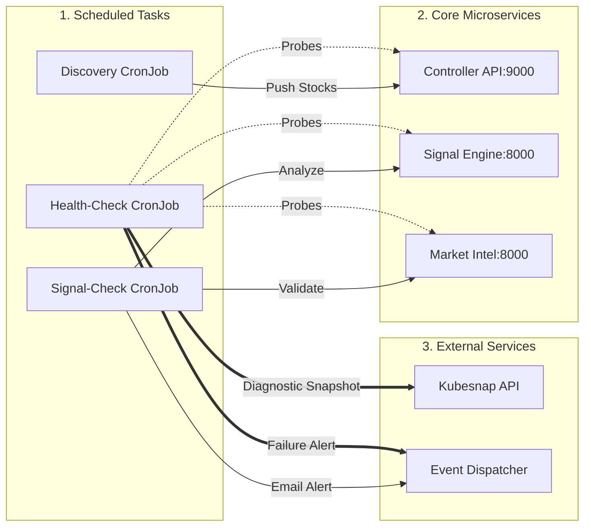

# StockFlow Architecture

StockFlow is an automated stock screening tool designed to filter through the NSE market to identify high-probability trading setups. It consists of three main microservices running in a Kubernetes environment. 

## Ecosystem Topology

## Daily Operations Pipeline

The system is fully automated via Kubernetes CronJobs and runs in three stages every morning:

1. **Discovery**: A CronJob runs at 01:30 UTC, scanning the NSE equity list to isolate the top 900 highest-volume stocks. This list is persisted into a Kubernetes ConfigMap.
2. **Analysis Orchestration**: The main `Signal-Check` CronJob reads the 900 tickers and requests mathematical analysis from the **Signal Engine**.
3. **AI Validation**: Setup candidates are passed to the **Market Intel Engine** where a GPT-5 model checks the list against institutional sentiment rules. 
4. **Notification**: The final list of validated stocks is formatted and handed to the [Event Dispatcher](https://github.com/tekpeek/event-dispatcher) for email delivery. (See a [sample email](docs/assets/Sample-Email.pdf) for reference.)

## Signal Generation (BharatQuant v4)

The **Signal Engine** evaluates potential trading opportunities using a strict, hierarchical approach. If a stock fails an earlier layer, processing stops immediately to save resources.

### Layer 1 (Macro Trend Filter)
The daily (1D) price must be trading above its 200-period Exponential Moving Average (EMA200), and the EMA50 must also be above the EMA200. This ensures we only buy established uptrends.

### Layer 2 (Market Structure)
The hourly (1H) chart is analyzed using a sliding window to detect local peaks and troughs. The system requires a confirmed **Higher Low** to proceed.

### Layer 3 (Trigger Confluence)
If the structure is confirmed, the engine calculates points based on four concurrent indicators:
* **RSI**: Bullish divergence. (+2 points)
* **Bollinger Bands**: Squeeze followed by an expansion. (+2 points)
* **CMF**: Positive Chaikin Money Flow (> 0.15). (+1 point)
* **MACD**: Bullish crossover. (+1 point)

The scores are aggregated to classify the strength of the signal.

## Automated Health Monitoring

Because StockFlow operates unattended, it relies on a local hourly health-check script (`healthcheck-execution.py`).
1. The script probes all three microservices.
2. If any service is unresponsive, the system requests a snapshot diagnostic from the external [Kubesnap](https://github.com/tekpeek/kubesnap) service.
3. The cluster then sends a critical failure alert to the operator via the [Event Dispatcher](https://github.com/tekpeek/event-dispatcher).
