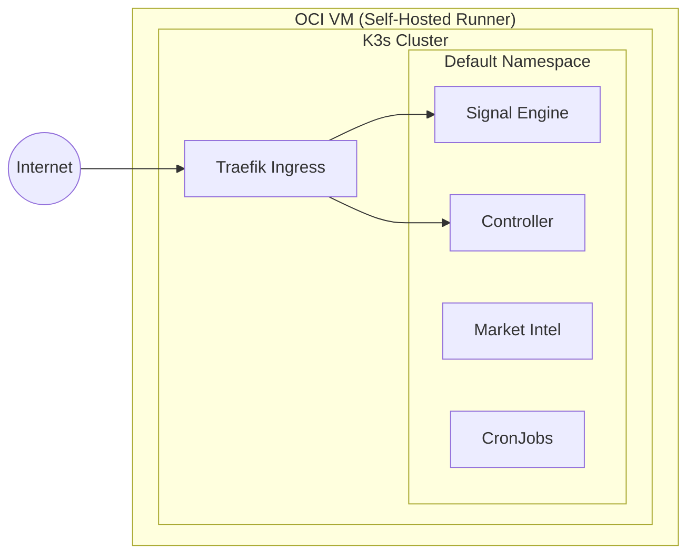

# Operations & Deployment Guide

This guide details the infrastructure, deployment procedures, and maintenance workflows for the StockFlow ecosystem.

## Infrastructure Map



## Deployment Lifecycle

### 1. Continuous Integration (CI)
- **Workflow**: `.github/workflows/build.yml`
- **Action**: Triggers on push to `main`. Builds Docker images for all microservices ensuring `stockflow-common` is built first as the base layer.
- **Storage**: Images are pushed to GitHub Container Registry (GHCR).

### 2. Continuous Deployment (CD)
- **Workflow**: `.github/workflows/deploy-stockflow.yml`
- **Action**: Uses Helm to deploy the application to the K3s cluster. Supports multi-environment namespaces (e.g., `default`, `dev`).

## Operational Commands

### Health Monitoring
The system uses `healthcheck-execution.py` to monitor service uptime.
- **Manual Check**:
  ```bash
  kubectl exec -it <pod-name> -- python /app/src/core/healthcheck-execution.py
  ```
- **Resilience Trigger**: If a service returns non-OK, the system automatically:
    1. Triggerrs a **Kubesnap** snapshot.
    2. Sends a health alert via **Event Dispatcher**.

### Maintenance Mode
To pause the system for updates without 404ing users:
1. **Enable**: `GET /api/admin/maintenance/on`
2. **Result**: Signal Engine and Market Intel will return a "Maintenance mode enabled" JSON response. Controller triggers a rollout restart of relevant pods.

## Security & Secrets
- **Internal Auth**: Admin APIs are protected by `X-API-KEY` validation.
- **Secret Management**: API Keys (OpenAI, SMTP) are stored in Kubernetes Secrets and injected as environment variables.
