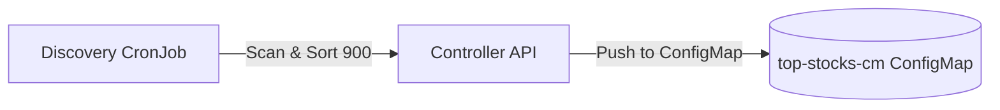
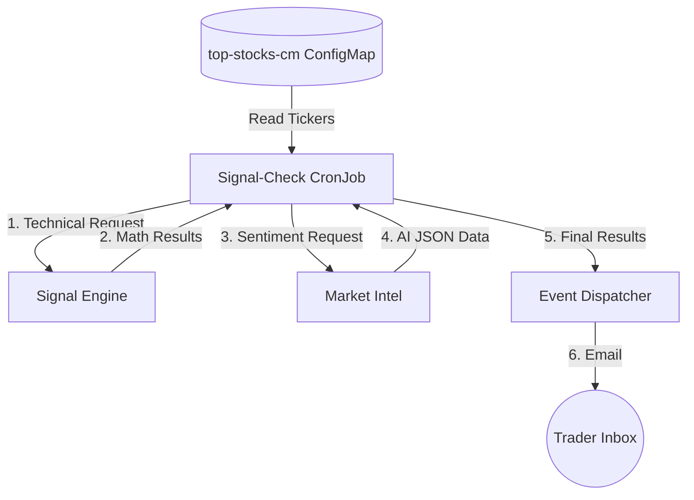
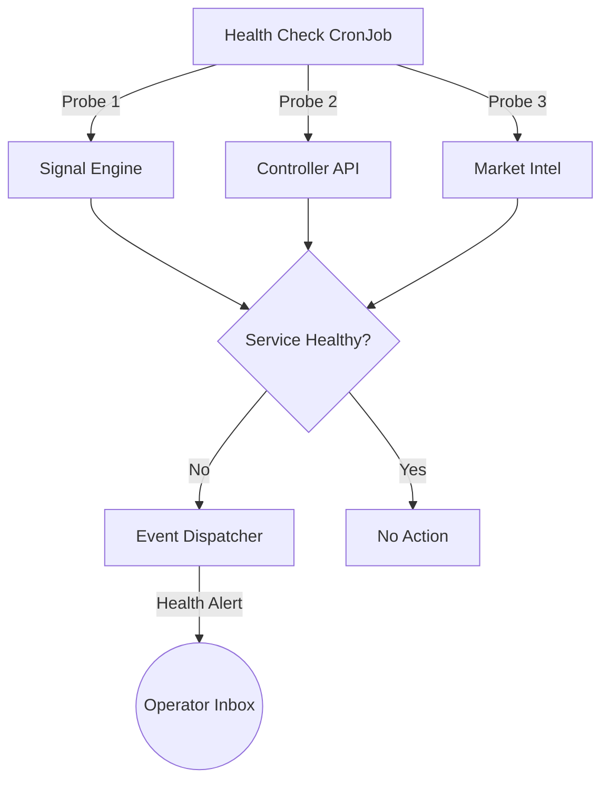

# StockFlow: Core Architecture & Ecosystem

StockFlow is an event-driven microservice ecosystem designed for real-time stock analysis and automated signal alerts. It follows a "Resilience Mesh" pattern, where independent services monitor and recovery each other through health-checks and snapshotting.

## System Context Diagram

The following diagram illustrates how StockFlow interacts with external systems within its ecosystem.

## System Workflows

The StockFlow ecosystem is organized into three distinct operational flows.

### 1. Market Scanning & Discovery
A morning process to identify the day's high-volume "stock universe."

### 2. Daily Analysis Orchestration
The core processing pipeline showing the central role of the Signal-Check orchestrator.

### 3. Health Check & Resilience
Automated monitoring with conditional alerting logic.

## Core Components

### 1. Daily Analysis Pipeline
- **Discovery**: A morning CronJob that filters the market for the top 900 high-volume stocks.
- **Controller**: Manages the persistence of results into Kubernetes ConfigMaps.
- **Signal-Check**: The main orchestrator that performs math (Signal Engine) and AI (Market Intel) verification.
- **Event Dispatcher**: The dedicated notification engine for sending emails.

### 2. Microservices
- **Signal Engine**: Handles technical indicator calculations (RSI, BharatQuant v4).
- **Market Intel**: Performs LLM-based sentiment analysis on filtered stocks.

## Resilience & Maintenance
- **Health Checks**: A dedicated CronJob monitors all microservices. If any service is unresponsive, it triggers an alert via the **Event Dispatcher**.
- **Maintenance Mode**: A public-facing API on the **Controller** allows toggling maintenance mode for the **Signal Engine**, pausing analysis logic without disrupting service uptime.
