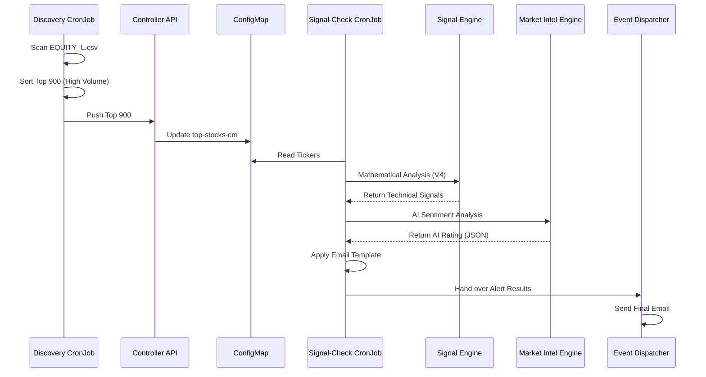

# Product Requirement Document: Discovery & Automation

This document outlines the automated pipeline responsible for scanning the NSE market, identifying high-volume opportunities, and validating them with AI sentiment analysis.

## Pipeline Overview

## Feature Summary

### 1. Discovery CronJob
- **Purpose**: Identifies the high-volume "stock universe" for the day.
- **Implementation**: Runs every morning at 01:30 UTC. Scans the full NSE equity list, fetches volume data for each, and sorts to identify the **top 900** most active stocks.
- **Persistence**: Sends the list to the **Controller API**, which persists it into the `top-stocks-cm` Kubernetes ConfigMap.

### 2. Signal-Check CronJob (Orchestrator)
- **Purpose**: The central workflow orchestrator for stock analysis.
- **Logic**:
    1. **Data Retrieval**: Reads the latest ticker list from the ConfigMap mount.
    2. **Technical Scan**: Passes tickers to the **Signal Engine** for mathematical BharatQuant v4 analysis.
    3. **AI Validation**: Hands over high-probability technical results to the **Market Intel Engine**.
    4. **Notification**: Consolidates results into an email template and hands them to the **Event Dispatcher**.

### 3. Market Intel Engine (MIE)
- **Purpose**: Adds an "Institutional Sentiment" layer to technical analysis.
- **Logic**: Uses GPT-5 to analyze the tickers against a curated `market_analysis_prompt.txt`.
- **Threshold**: Only stocks with an AI Buy Rating >= 5 are cleared for notification.

## User Stories

| ID | Role | Requirement | Acceptance Criteria |
|----|------|-------------|---------------------|
| US-DA-01 | System | Daily update of active stocks | Discovery engine must successfully update the Controller's ConfigMap by 02:00 UTC. |
| US-DA-02 | Trader | I want fundamental backup for technicals | System only alerts on stocks that pass both V4 (Technical) and GPT (Sentiment) filters. |

## Acceptance Criteria
1. The Discovery Engine must handle Yahoo Finance rate limiting by implementing sleep delays between batch requests.
2. The AI analysis must be formatted as a JSON object to ensure correct parsing by the orchestrator.
3. Notifications must only trigger if the final consolidated list contains at least one stock.
