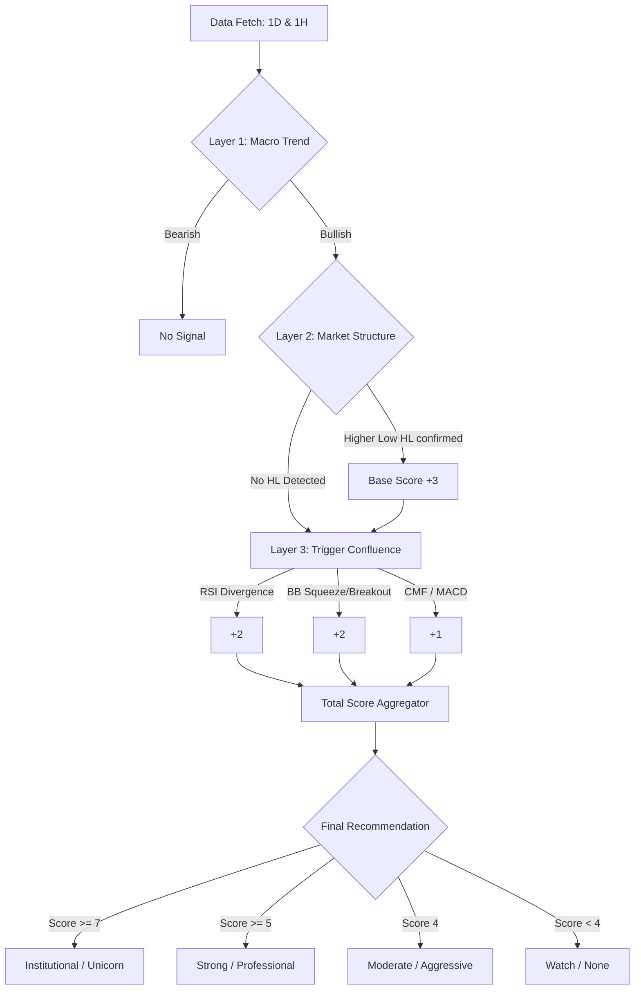

# Product Requirement Document: Signal Engine

The Signal Engine is the technical heart of StockFlow, responsible for transforming raw market data into actionable trading signals using the **BharatQuant v4** strategy.

## Feature Summary
A high-probability trading signal generator that employs a multi-timeframe "Hard Hierarchy" to reduce false positives and identify institutional-grade setups.

## BharatQuant v4 Logic Flow

## Technical Specification

### 1. Hard Hierarchy Layers
- **Layer 1 (Macro)**: Price must be > EMA200 and EMA50 must be > EMA200 on the Daily (1D) timeframe.
- **Layer 2 (Structure)**: Automated peak/trough detection on the Hourly (1H) timeframe to identify "Higher Lows".
- **Layer 3 (Trigger)**: Confluence of RSI Divergence, Bollinger Band Squeeze/Expansion, and Money Flow (CMF).

### 2. Output Metadata
Every buy signal includes:
- **Entry Price**: Current market price at detection.
- **Take Profit (TP)**: Calculated using 1.5x Average True Range (ATR).
- **Stop Loss (SL)**: Set at the most recent local trough (market structure support).

### 3. Individual Indicator API
Retrieve raw indicator data for debugging or visualization without aggregation logic.
- **Endpoint**: `/api/{stock_id}/{indicator}`
- **Indicators**: `rsi`, `macd`, `bb`, `cmf`.
- **Response**: Returns raw calculation results (e.g., RSI value, smooth RSI).

## User Stories

| ID | Role | Requirement | Acceptance Criteria |
|----|------|-------------|---------------------|
| US-SE-01 | Trader | I want to scan NSE stocks using multi-timeframe analysis | System fetches 1D and 1H data and validates Macro trend before analysis. |
| US-SE-02 | Trader | I want to avoid "choppy" markets | Signal is only generated if Macro Trend (Layer 1) is confirmed bullish. |
| US-SE-03 | Analyst | I want to see the reasoning for a buy signal | Response contains a `reason` string and a `signals` semicolon-separated list. |

## Acceptance Criteria
1. Must return a 404 error if an invalid stock symbol (not ending in `.NS`) is provided.
2. Must successfully calculate V4 score even if optional metadata (like ATR) is partially missing.
3. Must respect `MAINTENANCE_STATUS` flag and pause analysis when enabled.
