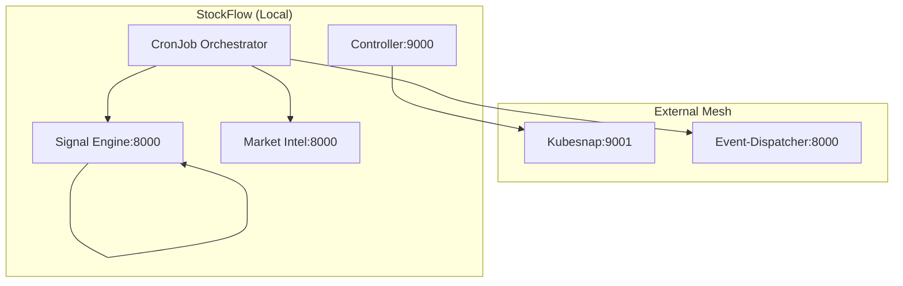

# Technical Specification: StockFlow Architecture

This document translates the functional requirements of the StockFlow system into a technical design for developers and operators.

## System Components & Inter-Service Communication

### Service Registry & Routing
StockFlow utilizes Kubernetes Services for internal discovery and a Traefik Ingress for external access.

- **Ingress Controller (Traefik)**:
    - `GET /api/*` -> `signal-engine-service:8000` (Public)
    - `GET /api/admin/*` -> `sf-ctrl-service:9000` (Protected)
- **Internal Service Hostnames**:
    - `signal-engine-service:8000`
    - `market-intel-engine-service:8000`
    - `sf-ctrl-service:9000`

### Ecosystem Topology

## Resilience Implementation

### Health Check Chain
1. **Collector**: `healthcheck-execution.py` runs hourly.
2. **Targets**: All three microservices via `/api/health`, `/api/admin/health`, and `/health`.
3. **Failure Flow**:
    - **Step A**: Call Kubesnap `GET /api/kubesnap/{deploy_type}` to capture a diagnostic snapshot. Requires `X-API-Key`.
    - **Step B**: POST failure JSON to Event-Dispatcher `/api/v1/health-alert`.

## Security Design

- **Static Token Auth**: `X-API-Key` is passed in headers for all `controller` endpoints.
- **Environment Injection**: Secrets are mounted as environment variables (`SF_API_KEY`, `OPENAI_API_KEY`).
- **Namespace Isolation**: Cross-namespace communication to `Kubesnap` is hardcoded via FQDN.

## Operational Logic

### Maintenance Mode Propagation
- **Persistence**: Status stored in `maintenance-config` ConfigMap.
- **Propagation**: Changing status via Controller API triggers a `PATCH` on the ConfigMap and a `rollout restart` of the `signal-engine` deployment to clear memory and re-initialize state.
